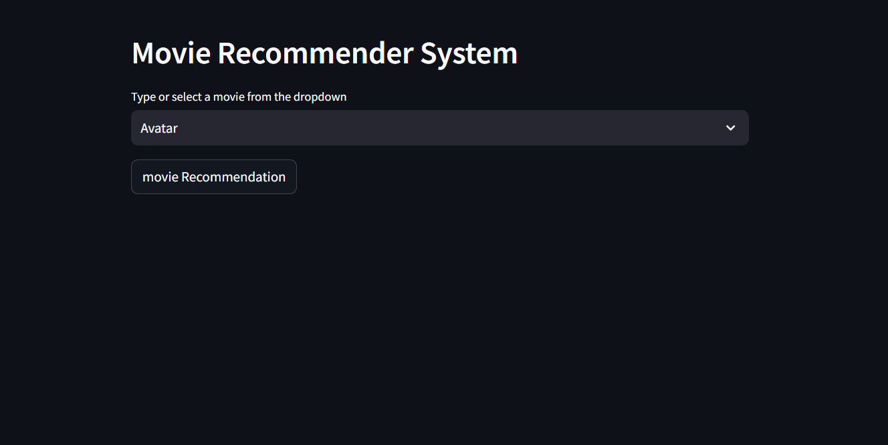
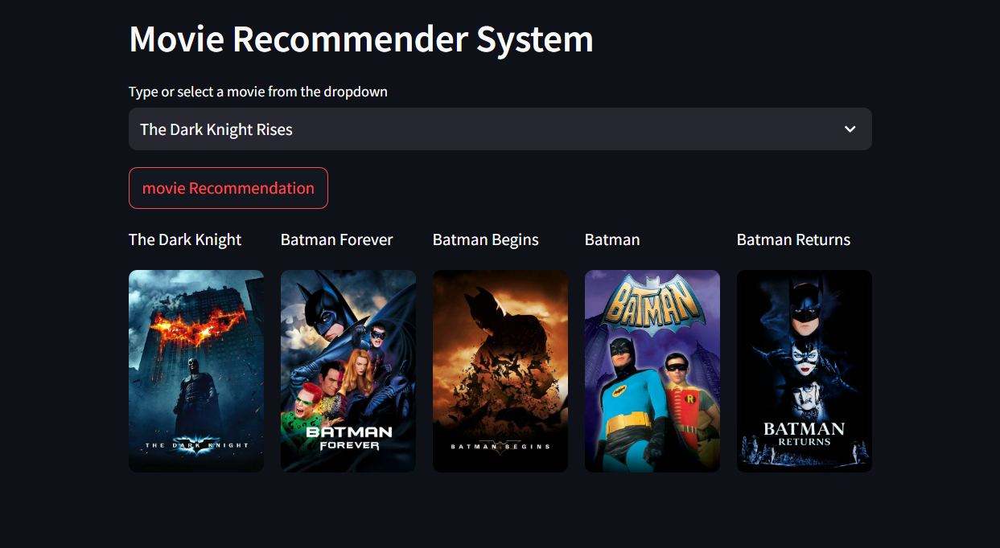

# Movie Recommendation System

This project is a **Movie Recommendation System** built using **Python**, **Streamlit**, and the **Kaggle TMDB 5000 Movies Dataset**. It employs content-based and collaborative filtering techniques to recommend similar movies to users. The application also integrates with the **TMDB API** to fetch and display movie posters.

## Features

- **Movie Recommendation**: Recommends movies similar to the one selected by the user.
- **Poster Fetching**: Uses the TMDB API to fetch and display movie posters for the recommended movies.
- **User Interface**: Implemented using Streamlit for an interactive experience.
- **Model**: The recommendation model is trained with an 80-20 train-test split using content vectorization techniques.

## Project Structure

- **`recommend()`**: Function that takes a movie title as input and returns 5 recommended movies with posters.
- **`fetch_poster()`**: Function to fetch the poster of a movie using the TMDB API.
- **Jupyter Notebook**: The model is trained in a Jupyter Notebook using the Kaggle TMDB 5000 movies dataset.
- **Pickle Files**: The movie data and similarity matrix are stored as `movies_system.pkl` and `similarity.pkl`.

## How to Run

1. **Clone the repository**:
   ```bash
   git clone https://github.com/your-username/Movie-Recommendation.git
   cd movie-recommendation-system
   ```

2. **Install dependencies**:
   ```bash
   pip install -r requirements.txt
   ```

3. **Run the Streamlit app**:
   ```bash
   streamlit run app.py
   ```

4. **Interact with the UI**:
   - Select a movie from the dropdown menu, and click the "Movie Recommendation" button to see the recommended movies and their posters.

## Screenshots

### 1. **User Interface: Movie Selection Screen**



### 2. **Movie Recommendations with Posters**



## Dependencies

- **Python 3.7+**
- **Streamlit** for UI
- **Requests** for API calls
- **Pickle** for loading model data
- **scikit-learn** for content vectorization and model building
- **Kaggle TMDB 5000 Movies Dataset**

## API Usage

- The **TMDB API** is used to fetch the poster for the recommended movies. You need an API key from [The Movie Database](https://www.themoviedb.org/).

## How It Works

- The model uses a content-based filtering approach, where it calculates the similarity between the selected movie and other movies using content vectorization.
- It returns the top 5 most similar movies and fetches their posters using the TMDB API.

## Example

- Input: `The Dark Knight`
- Output: 5 movies similar to The Dark Knight, along with their posters.

## Future Improvements

- Add user-based collaborative filtering for better recommendations.
- Improve the model by considering genres, cast, or user ratings.
- Implement a search functionality for faster movie selection.

## License

This project is licensed under the MIT License - see the [LICENSE](LICENSE) file for details.
